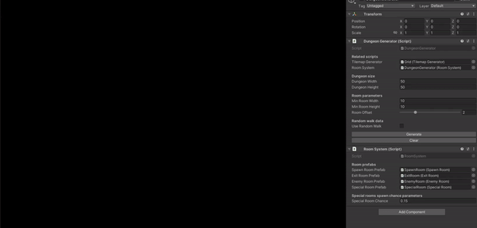
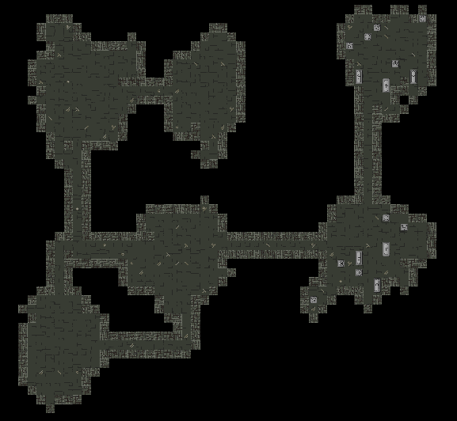
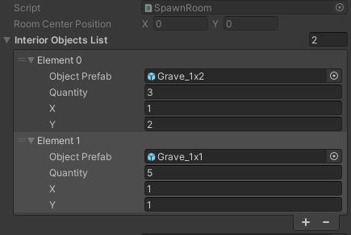

# Roguelike Dungeon Generator
This project is a 2D top-down dungeon generation tool.
Presented tool was created with the intention of using it in roguelike-styled games.

## Features:
1. Customisable dungeon layout by provided set of parameters
2. Possibility of creating one from two room shapes (rectangular or random)
3. Sample interior generation
4. Modular room type system

## How it works?
Creating empty dungeon:
- Dividing the dungeon space into smaller spaces using the [Binary Space Partitioning](https://en.wikipedia.org/wiki/Binary_space_partitioning) in order to create suitable place for each room.
- Creating rectangular rooms (or randomly shaped rooms based on implemented [Random Walk algorithm](https://en.wikipedia.org/wiki/Random_walk)) and puting each created room inside list.
- Storing each room's center position and it's floors positions set.
- Creating narrow corridors by linikng neighbouring rooms together.

Interior generation:
- Puting each created room's center position and floors position set into dictionary.
- Spawning room prefabs and setting appropriate values for them based on rooms dictionary (first: spawn room, last: exit room, middle: enemy room and chance for special room with treasure)
- Setting available floors position for each room based on room dictionary
- Spawning interior objects on available floor positions and updating list of available positions.

Interior object is a struct that stores object's prefab, max quantity along with it's width and height. With this approach creating dungeon interiors its much easier.

## My package
Here is a link for my custom package, which i used in this project:
https://github.com/Skallu0711/Skallu-Utils
