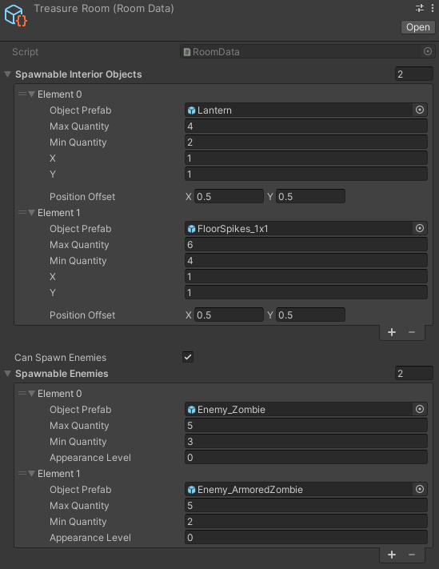

# EZ Dungeon
"EZ Dungeon" is procedural 2D top-down grid based generation tool.

## Main Features:
1. Procedural generation
2. Customisable layout
3. Room type classification system
4. Interior generation subsystem
5. Grid based design

## Overview:

### Dungeon generation

Whole dungeon generation process is based on two implemented algorithms:
* ["Binary space partitioning"](https://en.wikipedia.org/wiki/Binary_space_partitioning) in order to designate proper places for rooms to be created
* ["Random walk"](https://en.wikipedia.org/wiki/Random_walk) in order to create floors and walls in spaces designated earlier

### Room type classification
One of the main goals was to ensure some diversity, therefore a system of classifying rooms into types was created.

I have designed some sample types with their primitive use cases:
* Spawn room - starting room (e.g. place where player character will be spawned)
* Enemy Room - (e.g. room where enemies are being spawned)
* Exit room - ending room (e.g. place where gate to next level is located)
* Special room - (e.g. treasure room or merchant's room)

You can easily add more or reduce number of room types by modifying system's parameters.

### Interior generation
In order to add some life into dungeon rooms, an interior generation system has been implemented.

One of the main goals was to create the simpliest way of spawning prefabs of some objects and enemies inside grid based rooms.
For this purpose an ["Interior object"](EZ_Dungeon/LevelGeneration/InteriorGeneration/InteriorObject.cs) structure has ben designed.

For each interior object we store:
* Its prefab
* Its quantity range (between min and max)
* Its grid width and height
* Its possition offset (to prevent the need of playuing with every sprite's pivot)

Thanks to this approach, we are able to easily spawn and manipulate objects and fit them equally with the grid.

## My package
Here is a link for my custom package, which i used in this project:
https://github.com/Skallu0711/Skallu-Utils